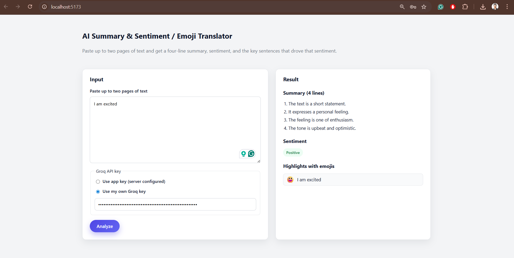

# Emojify ✨🙂

> Paste any text, get an AI-powered **4-line summary**, **sentiment analysis**, and **key sentences paired with emojis** — all in seconds.


---

## Screenshot



---

## What It Does

Emojify takes any block of text (up to ~2 pages) and uses **Groq's LLaMA 3.3 70B** model (via LangChain) to return:

| Output | Description |
|---|---|
| **Summary** | Exactly 4 concise lines distilling the input |
| **Sentiment** | `positive`, `neutral`, or `negative` |
| **Highlights** | Key sentences that justify the sentiment, each paired with a relevant emoji |

---

## Tech Stack

| Layer | Technology |
|---|---|
| **Frontend** | React 19 · TypeScript · Vite 7 |
| **Backend** | FastAPI · LangChain · Groq (LLaMA 3.3 70B) |
| **Validation** | Pydantic v2 (request/response schemas + structured LLM output parsing) |
| **Deployment** | Vercel (dual-project setup) |

---

## Project Structure

```
emojify/
├── backend/
│   ├── app/
│   │   ├── main.py          # FastAPI app factory, CORS, routes
│   │   ├── llm.py           # LangChain prompt + Groq chain + Pydantic output parser
│   │   ├── schemas.py       # AnalyzeRequest / AnalyzeResponse / Highlight models
│   │   └── config.py        # Pydantic Settings (env-based config)
│   └── requirements.txt
├── frontend/
│   ├── src/
│   │   ├── main.tsx          # App root — state management, layout
│   │   ├── InputForm.tsx     # Text input + Groq API key toggle
│   │   ├── ResultView.tsx    # Summary, sentiment badge, emoji highlights
│   │   ├── api.ts            # Typed fetch wrapper for /api/analyze
│   │   └── style.css         # Clean, responsive UI styles
│   ├── package.json
│   └── vite.config.ts
├── .gitignore
└── readme.md
```

---

## How It Works

```
┌──────────────┐    POST /api/analyze     ┌──────────────┐     LangChain      ┌──────────┐
│   React UI   │ ──────────────────────►  │   FastAPI     │ ────────────────►  │  Groq    │
│  (Vite/TS)   │ ◄──────────────────────  │   Backend     │ ◄────────────────  │  LLaMA   │
└──────────────┘    JSON response         └──────────────┘   Structured JSON   └──────────┘
```

1. User pastes text into the React frontend
2. Frontend sends a `POST` request to `/api/analyze` with the text (and optionally a user-provided Groq API key)
3. Backend builds a LangChain prompt chain with a **Pydantic output parser** to guarantee structured JSON
4. Groq's LLaMA 3.3 70B generates the summary, sentiment, and highlights
5. Response is validated through Pydantic schemas and rendered in the UI with color-coded sentiment badges and emoji highlights

---

## API Reference

### `GET /health`

Returns `{ "status": "ok" }`.

### `POST /api/analyze`

**Request body:**

```json
{
  "text": "Your text to analyze...",
  "use_own_key": false,
  "groq_api_key": "gsk_..."
}
```

| Field | Type | Default | Description |
|---|---|---|---|
| `text` | `string` | *required* | The text to analyze (up to ~2 pages) |
| `use_own_key` | `boolean` | `false` | Whether to use a user-provided Groq key |
| `groq_api_key` | `string?` | `null` | Required when `use_own_key` is `true` |

**Response:**

```json
{
  "summary_lines": [
    "Line one of the summary.",
    "Line two of the summary.",
    "Line three of the summary.",
    "Line four of the summary."
  ],
  "sentiment": "positive",
  "highlights": [
    { "sentence": "This was an outstanding achievement.", "emoji": "🏆" },
    { "sentence": "The team exceeded all expectations.", "emoji": "🚀" }
  ]
}
```

---

## Getting Started

### Prerequisites

- **Python 3.10+**
- **Node.js 18+**
- A **[Groq API key](https://console.groq.com/)** (free tier available)

### 1. Backend

```bash
cd backend

# Create & activate virtual environment
python -m venv .venv
source .venv/bin/activate        # Mac/Linux
# .venv\Scripts\activate         # Windows

# Install dependencies
pip install -r requirements.txt

# Configure environment
cat > .env << EOF
groq_api_key=YOUR_GROQ_API_KEY
groq_model=llama-3.3-70b-versatile
EOF
```

> **Note:** Keys in `.env` must be **lowercase** — the app uses `case_sensitive=True` in Pydantic Settings.

```bash
# Start the server
uvicorn app.main:app --reload --port 8000
```

Verify it's running: `curl http://localhost:8000/health`

### 2. Frontend

```bash
cd frontend
npm install
npm run dev
```

Open **http://localhost:5173** — the frontend proxies API calls to `localhost:8000` by default.

To point at a different backend, create `frontend/.env`:

```env
VITE_API_BASE_URL=http://localhost:8000
```

---

## Deployment (Vercel)

Deploy as **two separate Vercel projects** from the same repository:

| Project | Root Directory | Framework Preset |
|---|---|---|
| Backend | `backend` | Python (FastAPI) |
| Frontend | `frontend` | Vite |

After deploying both:

1. Copy the backend project's production URL
2. Set the environment variable `VITE_API_BASE_URL` in the frontend project to that URL
3. Redeploy the frontend

---

## Environment Variables

| Variable | Where | Description |
|---|---|---|
| `groq_api_key` | Backend `.env` | Your Groq API key |
| `groq_model` | Backend `.env` | Model name (default: `llama-3.3-70b-versatile`) |
| `backend_cors_origins` | Backend `.env` | Allowed CORS origins (JSON array, optional) |
| `VITE_API_BASE_URL` | Frontend `.env` | Backend URL (default: `http://localhost:8000`) |

---
